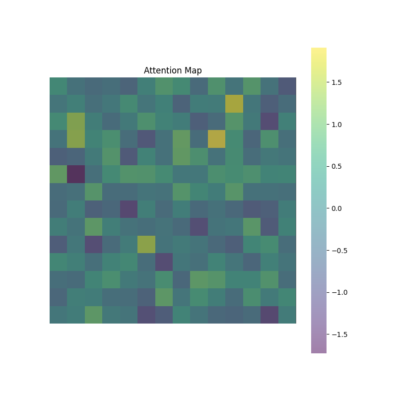

# 🎮 Binary Vision Transformer (BinaryViT) - Dog vs. Not Dog Classification

This project implements **BinaryViT**, a Vision Transformer (ViT)-based **binary image classification model** to distinguish between **dogs and non-dogs** using the **DeiT-Small (deit_small_patch16_224)** model. The entire process, including **training, testing, hyperparameter tuning (Optuna), inference, and attention visualization**, is executed inside a **single Jupyter notebook**:  
📌 **`dog-not-dog-minvit.ipynb`**

---

## **📂 Project Structure**
```
/kaggle/
│── /input/                    # Read-only input dataset directory
│   ├── /dog-vs-not-dog/        # Contains images + labels.csv
│── /working/                   # Writable directory (outputs)
│   ├── binaryvit_dog_vs_not_dog_best.pth  # Saved trained model
│   ├── prediction.txt          # Inference output
│   └── attention_map.png       # Visualized attention map
│── dog-not-dog-minvit.ipynb     # Jupyter Notebook (All Steps)
│── README.md                    # This documentation
```

---

## **📘 Relevant Research Papers**
### **1. Vision Transformer (ViT) - Foundational Paper**
**Title:** An Image is Worth 16x16 Words: Transformers for Image Recognition at Scale  
**Authors:** Alexey Dosovitskiy et al.  
**Summary:** Introduces the Vision Transformer (ViT) model, demonstrating that a pure transformer architecture can achieve excellent results on image classification tasks when trained on large datasets.  
**Link:** [https://arxiv.org/abs/2010.11929](https://arxiv.org/abs/2010.11929)  

### **2. Data-Efficient Image Transformer (DeiT)**
**Title:** Training data-efficient image transformers & distillation through attention  
**Authors:** Hugo Touvron et al.  
**Summary:** Presents the Data-efficient Image Transformer (DeiT), which improves the training efficiency of ViTs using a teacher-student distillation approach and data augmentation techniques.  
**Link:** [https://arxiv.org/abs/2012.12877](https://arxiv.org/abs/2012.12877)  


---

## **👜 Dataset**
We use the **Dog vs Not Dog** dataset from Kaggle. **Dataset Link:** [Dog Vs Non Dog Dataset](https://www.kaggle.com/datasets/danielshanbalico/dog-vs-not-dog), 
The dataset contains:
- **Images of dogs** (`/dog/`)
- **Images of non-dogs** (`/other/`)
- A **CSV file (`labels.csv`)** containing image filenames and labels (`dog` or `other`).

### **📌 How to Attach the Dataset in Kaggle**
1. **Go to your Kaggle notebook (`dog-not-dog-minvit.ipynb`).**
2. **Click on "Add Data" (Right Panel).**
3. **Search for "Dog vs Not Dog Dataset" and attach it.**
4. The dataset will be available at:
   ```python
   INPUT_PATH = "/kaggle/input/dog-vs-not-dog/"
   ```

---

## **🚀 What Does `dog-not-dog-minvit.ipynb` Do?**
✅ **1. Preprocess Data** (Image transformations, handling missing images)  
✅ **2. Train Model with Hyperparameter Tuning** (Optuna finds the best ViT hyperparameters)  
✅ **3. Save Best Model** (`binaryvit_dog_vs_not_dog_best.pth`)  
✅ **4. Perform Inference** (Predict dog vs. not-dog on test images)  
✅ **5. Extract & Visualize Attention Maps** (See where the model focuses!)

---

## **🗒️ Running the Notebook**
### **Step 1️⃣: Install Dependencies (Kaggle)**
📌 If using Kaggle, the required libraries are pre-installed. Otherwise, run:
```bash
pip install torch torchvision timm optuna seaborn numpy matplotlib
```

### **Step 2️⃣: Run `dog-not-dog-minvit.ipynb`**
Simply **open the notebook and execute all cells**.  
This will:
1. **Train a ViT model** on the dataset.
2. **Find the best learning rate & batch size using Optuna.**
3. **Save the best model (`binaryvit_dog_vs_not_dog_best.pth`).**
4. **Test the model on a sample image (`sample.jpg`).**
5. **Generate & visualize the attention map (`attention_map.png`).**

---

## **📉 Model Training**
### **Training Highlights**
- **Uses `timm.create_model("deit_small_patch16_224")`** for training.
- **Optimized learning rate & batch size using Optuna.**
- **Saves the best model to `/kaggle/working/binaryvit_dog_vs_not_dog_best.pth`.**

### **Hyperparameter Tuning (Optuna)**
📌 The notebook **automatically finds the best hyperparameters** for ViT using Optuna.
```python
import optuna
study = optuna.create_study(direction="maximize")
study.optimize(objective, n_trials=5)
best_params = study.best_params
```
📌 **Best batch size & learning rate** are applied for final training.

---

## **💯 Inference & Attention Visualization**
After training, the notebook **performs inference** on a test image and **visualizes the model's attention**.

### **📌 Inference on Sample Image**
1. **Loads trained model**
2. **Classifies a test image (`sample.jpg`)**
3. **Extracts & visualizes the attention map**

```python
test_img_path = "/kaggle/input/a/other/default/1/sample.jpg"
```

### **📅 Expected Outputs**
- **`prediction.txt`** (e.g., `"Predicted Class: Dog"`)
- **`attention_map.png`** (heatmap overlay on image)

---

## **📊 Example Visualization**
  
🔍 **Darker regions = Model's focus areas!**

---

## **📀 Key Features**
✅ **Uses Transformers (ViT) for image classification**  
✅ **Hyperparameter tuning with Optuna**  
✅ **Attention heatmap visualization**  
✅ **Kaggle-compatible, saves outputs in `/kaggle/working/`**  

---

## **💾 How to Download Results in Kaggle**
After running the notebook:
1. Open **"Files"** in the right panel of the Kaggle Notebook.
2. Navigate to **`/kaggle/working/`**.
3. Download:
   - **`binaryvit_dog_vs_not_dog_best.pth`** → Trained model
   - **`prediction.txt`** → Classification result
   - **`attention_map.png`** → Model’s attention map

---

## **📓 Model Explanation**
- We use **DeiT-Small (Distilled ViT)** (`deit_small_patch16_224`).
- Input images are **split into 14×14 patches**.
- **Self-Attention Mechanism** allows the model to focus on important regions.
- We extract **attention from the last transformer block** for visualization.


